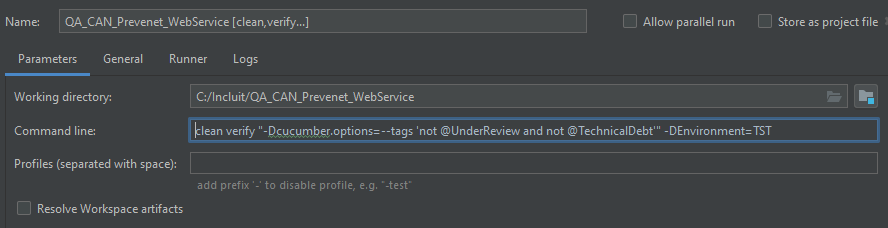

# **APIs WEB SERVICES**
La finalidad del proyecto es realizar validaciones sobre todos los métodos de los servicios desarrollados por APIs. Validaciones que se encuentran alineadas con los casos de prueba diseñados para las pruebas manuales por el equipo localizado en las oficinas de IncluIT. Pruebas que pueden ser halladas en el proyecto APIs en Jira 

## Instalaciones necesarias                                                       
* Asegurarse de tener correctamente instalados Java y Maven. 
    * Al escribir los comandos java -version y mvn -v deberiamos ver las versiones correspondientes.

## Ubicando nuestro proyecto
* Dirigirse al directorio raiz del proyecto a traves de la consola o navegando mediante las ventanas de Windows
* Si lo hizo de forma manual ahora debera abrir una consola en dicha ubicacion

## Ejecutando nuestra suite
Tenemos dos opciones a la hora de correr nuestros escenarios:
1. Para correr toda la suite escribir el comando `mvn clean verify -DEnvironment=%ENV%`
    * Se debe reemplazar `%ENV%` por el valor que corresponda segun el entorno seleccionado:
        * DEV
        * TST 
        * PRE 
        * HOMOLOGACION
2. Para correr la suite de escenarios verificados o UnderReview  se debe agregar `"-Dcucumber.options=--tags 'nuestroTag'"`
    * Se debe reemplazar nuestroTag por el que corresponda a la suite seleccionada.
        * not @UnderReview and not @TechnicalDebt
        * @UnderReview
        * @TechnicalDebt
3. Para correr servicios o metodos especificos se debe agregar `"-Dcucumber.options=--tags '@nuestroTag'"`
    * Se debe reemplazar @nuestroTag por el tag que corresponda a nuestro servicio, método, historia o test case.
        * @servicio:Service1
        * @metodo:Method1
        * @historia:APIs-XXXX
        * @TC:APIs-XXXX

    Asi se veria la configuracion en IntelliJ:
    

## Visualizando el reporte
* Al finalizar la ejecución, podemos observar el reporte generado mediante el comando `start target/site/serenity/index.html`

## Suite SMOKE
* Caso exitoso más representativo (un TC por método)
    Ej: 
        - TC con campos obligatorios y opcionales
        - TC con campos opcionales (en caso de no tener campos obligatorios)
        - TC con campos obligatorios (en caso de no tener campos opcionales)

## Suite SANITY
* Casos exitosos y errores más representativo (varios TC por método)
    Ej: 
        - TC con campos obligatorios
        - TC con campos obligatorios y opcionales
        - TC con campos obligatorios y sin headers
        - TC con campos obligatorios y campo extra
        - TC con campos opcionales inválidos
        - TC con campos obligatorios y sin resultados
        - TC sin campos obligatorios
